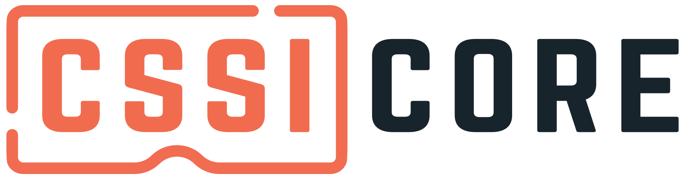

Python library for Cybersickness susceptibility testing

|  |ci-status| |contributors| |license| |reqs| |stars| |forks| |twitter|

Getting Started
===============

.. code:: bash

   # clone the repository
   git clone https://github.com/project-cssi/cssi-core.git

   # change the directory
   cd cssi-core

   # install dependencies and build the project
   make

Releases
========

Please read the `RELEASES.rst`_ guideline to learn about the process for releasing the project.

Changelog
=========

Please refer `CHANGELOG.md`_ to learn about the latest improvements,
breaking changes and bug fixes.

Built with
==========

.. raw:: html

    &ensp;&ensp;
    &ensp;&ensp;
    &ensp;&ensp;
    
    
    

Contributing
============

Please read `CONTRIBUTING.rst`_ for contributing guidelines and to learn
about our code of conduct.

License
=======

|FOSSA Status|

.. |FOSSA Status| image:: https://app.fossa.io/api/projects/git%2Bgithub.com%2Fproject-cssi%2Fcssi-core.svg?type=large
   :target: https://app.fossa.io/projects/git%2Bgithub.com%2Fproject-cssi%2Fcssi-core?ref=badge_large

.. Images for the BADGES

.. |ci-status| image:: https://travis-ci.com/project-cssi/cssi-core.svg?branch=master
    :target: https://travis-ci.com/project-cssi/cssi-core
    :alt: Build status
.. |contributors| image:: https://img.shields.io/github/contributors/project-cssi/cssi-core.svg?logo=github
    :target: https://github.com/project-cssi/cssi-core/graphs/contributors
    :alt: Contributors
.. |license| image:: https://img.shields.io/badge/License-MIT-blue.svg
    :target: ./LICENSE.txt
    :alt: License
.. |reqs| image:: https://requires.io/github/project-cssi/cssi-core/requirements.svg?branch=master
     :target: https://requires.io/github/project-cssi/cssi-core/requirements/?branch=master
     :alt: Requirements Status
.. |stars| image:: https://img.shields.io/github/stars/project-cssi/cssi-core.svg?logo=github
    :target: https://github.com/project-cssi/cssi-core/stargazers
    :alt: Github stars
.. |forks| image:: https://img.shields.io/github/forks/project-cssi/cssi-core.svg?logo=github
    :target: https://github.com/project-cssi/cssi-core/network/members
    :alt: Github forks
.. |twitter| image:: https://img.shields.io/twitter/follow/brion_mario.svg?label=brion_mario&style=flat&logo=twitter&logoColor=4FADFF
    :target: https://twitter.com/brion_mario
    :alt: nedbat on Twitter

.. _CHANGELOG.md: CHANGELOG.md
.. _CONTRIBUTING.rst: CONTRIBUTING.rst
.. _RELEASES.rst: docs/RELEASES.rst