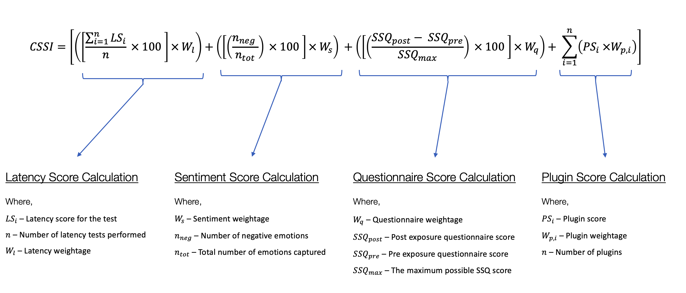

.. image:: ./docs/logos/cssi-logo-core.svg
    :width: 600 px

Python library for Cybersickness susceptibility testing

|  |ci-status| |contributors| |license| |reqs| |stars| |forks| |twitter| |fossa-status|

Getting Started
===============

.. code:: bash

   # clone the repository
   git clone https://github.com/project-cssi/cssi-core.git

   # change the directory
   cd cssi-core

   # install dependencies and build the project
   make

CSSI Algorithm
==============

The following algorithm was used in the ``cssi.core`` module to calculate the final CSSI Score.

Configuration
============

The host application must provide a configuration file and the name should be passed when instantiating the CSSI module.
If no config name is passed in, the library tries to read the config from the default file name i.e ``config.cssi``.

following is the format of a sample configuration file.

.. code-block:: ini

    [run]
    plugins =
        cssi_plugin_heart_rate

    [latency]
    latency_weight = 50
    latency_boundary = 3

    [sentiment]
    sentiment_weight = 30

    [questionnaire]
    questionnaire_weight = 20

    [cssi_plugin_heart_rate]
    weight = 0

Publications
============

The following publications have been made with respect to this project.

.. raw:: html

   <table>
      <thead>
         <tr>
            <th>Type</th>
            <th>Title</th>
            <th>Link</th>
         </tr>
      </thead>
      <tbody>
         <tr>
            <td>Review Paper</td>
            <td>Early Prediction of Cybersickness in Virtual, Augmented & Mixed Reality Applications: A Review</td>
            <td><a href="https://www.researchgate.net/publication/330853906_Early_Prediction_of_Cybersickness_in_Virtual_Augmented_Mixed_Reality_Applications_A_Review">Researchgate</a></td>
         </tr>
      </tbody>
   </table>

Releases
========

Please read the `RELEASES.rst`_ guideline to learn about the process for releasing the project.

Changelog
=========

Please refer `CHANGELOG.md`_ to learn about the latest improvements,
breaking changes and bug fixes.

Built with
==========

.. raw:: html

    &ensp;&ensp;
    &ensp;&ensp;
    &ensp;&ensp;
    
    
    

Contributing
============

Please read `CONTRIBUTING.rst`_ for contributing guidelines and to learn
about our code of conduct.

License
=======

|FOSSA Status|

.. |FOSSA Status| image:: https://app.fossa.io/api/projects/git%2Bgithub.com%2Fproject-cssi%2Fcssi-core.svg?type=large
   :target: https://app.fossa.io/projects/git%2Bgithub.com%2Fproject-cssi%2Fcssi-core?ref=badge_large

.. Images for the BADGES

.. |ci-status| image:: https://travis-ci.org/project-cssi/cssi-core.svg?branch=master
    :target: https://travis-ci.org/project-cssi/cssi-core
    :alt: Build status
.. |contributors| image:: https://img.shields.io/github/contributors/project-cssi/cssi-core.svg?logo=github
    :target: https://github.com/project-cssi/cssi-core/graphs/contributors
    :alt: Contributors
.. |license| image:: https://img.shields.io/badge/License-MIT-blue.svg
    :target: ./LICENSE.txt
    :alt: License
.. |reqs| image:: https://requires.io/github/project-cssi/cssi-core/requirements.svg?branch=master
     :target: https://requires.io/github/project-cssi/cssi-core/requirements/?branch=master
     :alt: Requirements Status
.. |stars| image:: https://img.shields.io/github/stars/project-cssi/cssi-core.svg?logo=github
    :target: https://github.com/project-cssi/cssi-core/stargazers
    :alt: Github stars
.. |forks| image:: https://img.shields.io/github/forks/project-cssi/cssi-core.svg?logo=github
    :target: https://github.com/project-cssi/cssi-core/network/members
    :alt: Github forks
.. |twitter| image:: https://img.shields.io/twitter/follow/brion_mario.svg?label=brion_mario&style=flat&logo=twitter&logoColor=4FADFF
    :target: https://twitter.com/brion_mario
    :alt: Twitter
.. |fossa-status| image:: https://app.fossa.io/api/projects/git%2Bgithub.com%2Fproject-cssi%2Fcssi-core.svg?type=shield
    :target: https://app.fossa.io/projects/git%2Bgithub.com%2Fproject-cssi%2Fcssi-core?ref=badge_shield
    :alt: FOSSA Status

.. _CHANGELOG.md: CHANGELOG.md
.. _CONTRIBUTING.rst: CONTRIBUTING.rst
.. _RELEASES.rst: docs/RELEASES.rst